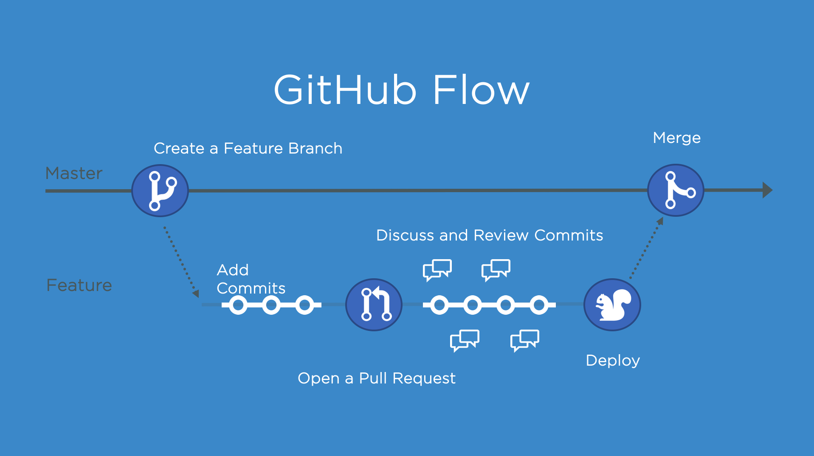

# git-learn
## 工作区域和文件状态


## 添加和提交文件
```bash
git status [-s]
git add *.txt # 添加所有txt文件到暂存区
git add . # 添加当前文件夹下所有文件到暂存区
git commit -m "..."
git commit -am "..." # 自动将已追踪的文件的修改添加到暂存区并提交
git log [--oneline] # 查看提交信息
git reflog # 查看所有操作记录
``` 
## git reset


## git diff
```bash
git diff # 比较工作区和暂存区
git diff HEAD # 比较工作区和版本库
git diff --cached # 比较暂存区和版本库
git diff $ID1/HEAD~i $ID2/HEAD [$FILE]# 比较两次版本提交（可只比较具体文件）
git diff $BRANCH1 $BRANCH2 # 比较两个分支
```

## git rm
```bash
git rm $FILE # 从工作区和暂存区删除
git rm --cached $FILE # 从暂存区中删除，但保留在工作区
```

## .gitignore

```bash
*.a # 忽略所有.a文件
!lib.a # 但追踪lib.a
/TODD # 忽略当前目录下的TODO文件
build/ # 忽略任何目录下的build文件夹
doc/*.txt # 忽略doc/notes.txt，但不忽略doc/server/arch.txt
doc/**/*.txt # 忽略doc/notes.txt和doc/server/arch.txt 
```

## 关联 GitHub
```bash
# 添加远程仓库
git remote add <远程仓库别名> <远程仓库地址>
# 向远程仓库推送
git push -u <远程仓库别名> <本地分支名:远程分支名> # 如果两者相同可以只写一个
# 查看远程仓库
git remote -v
# 拉取远程仓库内容
git pull <远程仓库别名> <远程分支名:本地分支名>
```

## 分支管理
```bash
git branch # 查看分支
git branch $BRANCH_NAME # 创建分支
git switch/checkout $BRANCH_NAME # 切换分支
git merge $BRANCH_NAME # 合并BRANCH_NAME分支到当前分支
git branch -d $BRANCH_NAME # (分支已被合并)删除分支
git branch -D $BRANCH_NAME # (分支还未被合并)强制删除分支
git merge --abort # 取消合并
```

## git rebase
```bash
git rebase $BRANCH_NAME # 将当前分支的提交移动到BRANCH_NAME分支上
```

## github flow
